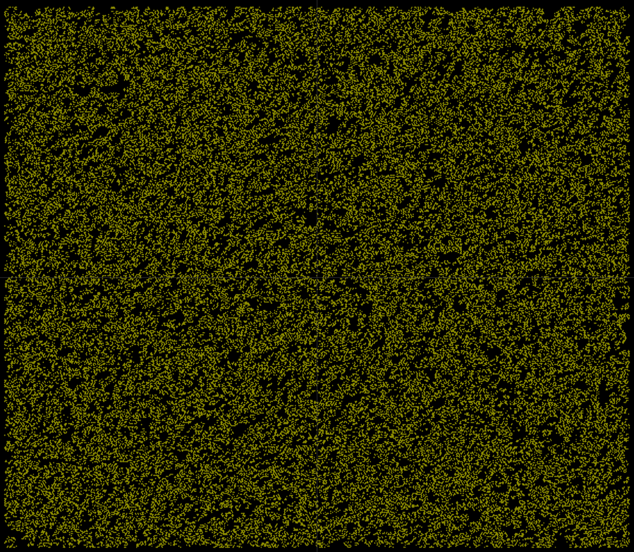

# Monoverse

Simulating the universe, one headache at a time.

### Hexagonal Cellular Automata



### Unbounded Hexagonal Cellular Automata


### Generic Instancing


### Performance Monitoring


## Notes for Physics Simulations

### Matter Construction

```text
Quark Construction:
    
Baryon Construction:
    Proton:
        Quarks:
            Up1 <-> Gluon <-> Up2
            Up2 <-> Gluon <-> Down1  
            Down1 <-> Gluon <-> Up1  
    Neutron:
        Quarks:
            Up1 <-> Gluon <-> Down1
            Down1 <-> Gluon <-> Down2  
            Down2 <-> Gluon <-> Up1          
```
