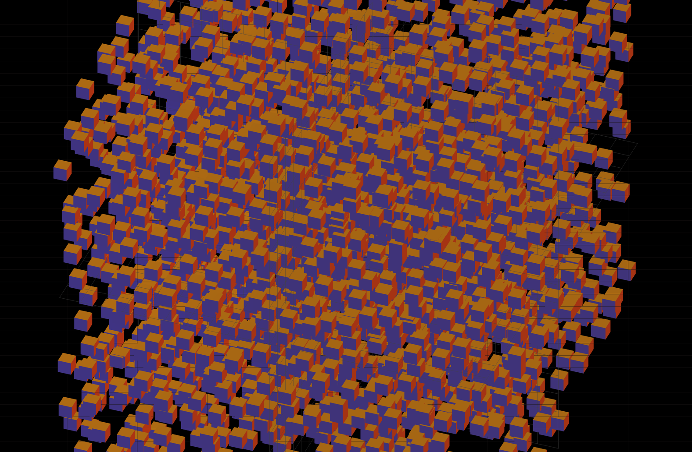
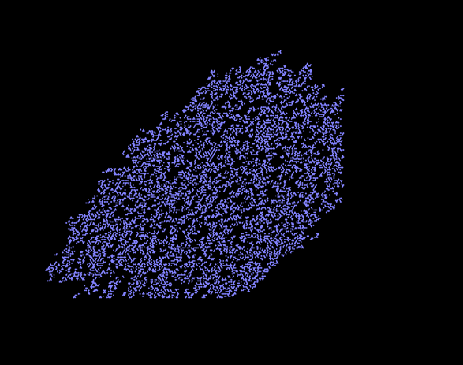
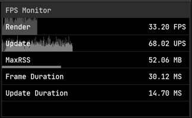

# Monoverse

Simulating the universe, one headache at a time.

While the project started off and technically still functions as a physics simulator, its more of a windowed graphics engine since last it was edited in 2021.

This project was retired and replaced by bradenn/nbodies.

### Hexagonal Cellular Automata


### Barnes Hut N-Bodies approximation


### Generic Instancing


### Unbounded Hexagonal Cellular Automata


### Performance Monitoring



## Notes for Physics Simulations

### Matter Construction

```text
Quark Construction:
    
Baryon Construction:
    Proton:
        Quarks:
            Up1 <-> Gluon <-> Up2
            Up2 <-> Gluon <-> Down1  
            Down1 <-> Gluon <-> Up1  
    Neutron:
        Quarks:
            Up1 <-> Gluon <-> Down1
            Down1 <-> Gluon <-> Down2  
            Down2 <-> Gluon <-> Up1          
```
